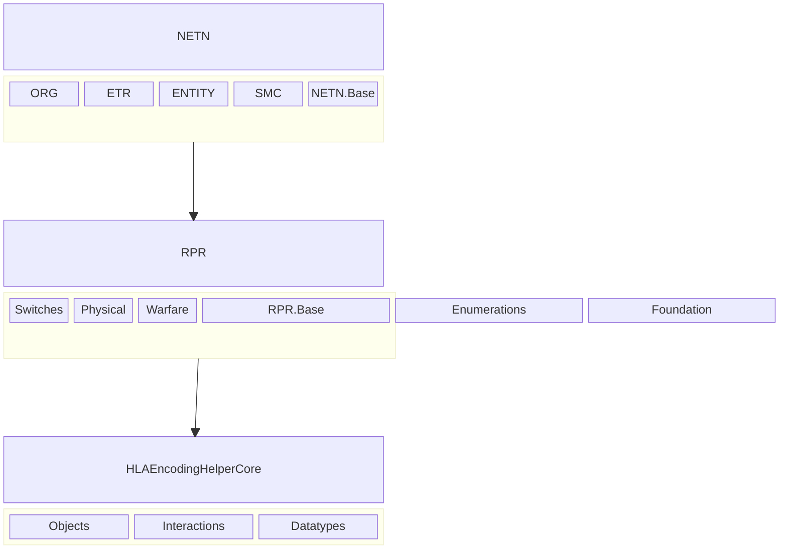

# OMT Encoding Helper

Helper Code for using HLA OMT files.

```mermaid
block-beta
columns 3

NETN:3
block:NetnModules:3
    ORG ETR ENTITY
    SMC:3
    NETN.Base:3 
end
space:3
RPR:3
block:RPRCore:3
    Switches Physical Warfare
    RPR.Base:3 
    Enumerations:3
    Foundation:3
end
space:3
HLAEncodingHelperCore:3
    block:Core:3
    Objects Interactions Datatypes
end

NetnModules --> RPR
RPRCore --> HLAEncodingHelperCore
```

    
